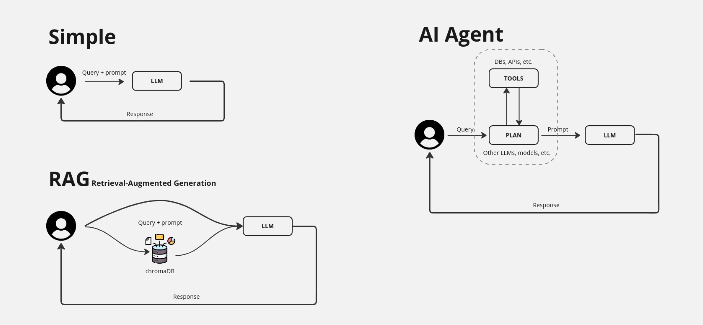
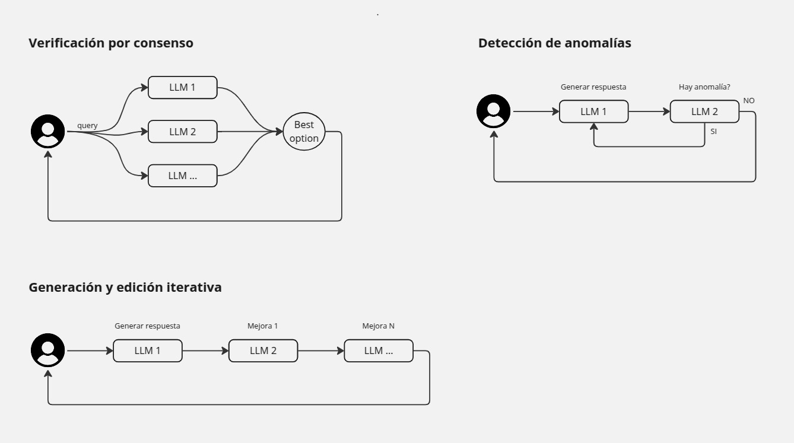

## Tabla de contenidos

- [Descripción del proyecto](#descripción-del-proyecto)
- [Pasos para la puesta en marcha](#pasos-para-la-puesta-en-marcha)
  - [Arrancar LLM(Large Language Model)](#arrancar-llm(large-language-model))
  - [Instalación de dependencias Python](#instalación-de-dependencias-python)
  - [Puesta en marcha del chatbot básico](#puesta-en-marcha-del-chatbot-básico)
  - [Puesta en marcha del chatbot con RAG](#puesta-en-marcha-del-chatbot-con-rag)
    - [Probar el script para trastear con ChromaDB](#probar-el-script-para-trastear-con-chromadb)
  - [Puesta en marcha del agente de IA](#puesta-en-marcha-del-agente-de-ia)
- [Técnicas con LLMs](#técnicas-con-llms)
  - [LLMs confrontados](#llms-confrontados)
    - [Arquitectura de "Verificación por consenso"](#arquitectura-de-"verificación-por-consenso")
    - [Arquitectura de "Detección de anomalías"](#arquitectura-de-"detección-de-anomalías")
    - [Arquitectura de "Generación y edición iterativa"](#arquitectura-de-"generación-y-edición-iterativa")
- [Referencias](#referencias)


# Descripción del proyecto

Este proyecto tiene como propósito convertirse en un recurso de referencia accesible para todos aquellos interesados en el apasionante mundo de los chatbots y los modelos de lenguaje a gran escala (LLMs, por sus siglas en inglés, Large Language Models). Nuestro fin es ofrecer una base sólida de conocimientos y herramientas prácticas que permitan a usuarios de cualquier nivel, desde principiantes hasta desarrolladores avanzados, incursionar en la creación de sus propios asistentes y aplicaciones basados en LLMs. Buscamos democratizar el acceso a esta tecnología y fomentar la innovación en el ámbito de la interacción entre humanos y máquinas.

De momento tenemos implementados y explicados tres técnicas básicas para crear chatbots y aplicaciones con LLMs: Chatbot básico(main.py), RAG(main_rag.py) y un agente de IA(main_agentia.py):



# Pasos para la puesta en marcha

## Arrancar LLM(Large Language Model)

Para comenzar, iniciamos el modelo de lenguaje (LLM, por sus siglas en inglés, Large Language Model) que servirá como fundamento de nuestro chatbot. Con el objetivo de simplificar su implementación y administración, optamos por ejecutar los LLM dentro de un contenedor Docker utilizando la plataforma Cortex. Esta estrategia nos permite aislar el entorno de ejecución del modelo, garantizando así una mayor estabilidad y portabilidad del proyecto, y ofreciendo la flexibilidad de ejecutarlo tanto en GPU como en CPU.

```
# Arrancamos el contenendor usando la CPU
docker run -it -d --name cortex -p 39281:39281 menloltd/cortex

#  O alternativamente, usando la GPU. Atención! Requiere los drivers 'nvidia-docker' y evidentemente el hardware adecuado
docker run --gpus all -it -d --name cortex -p 39281:39281 menloltd/cortex
```

En este caso, hemos seleccionado Llama 3.2 3B, un modelo de última generación conocido por su capacidad para generar texto de alta calidad aunque podemos usar otros modelos: 

```
# Descargamos el modelo y lo arrancamos 
docker exec -it cortex cortex run llama3.2:3b-gguf-q4-km

# O alternativamente, podemos usar otros modelos, como Phi de Microsoft 
docker exec -it cortex cortex run phi-3.5:3b-gguf-q4-km

# O alternativamente, podemos usar otros modelos, como DeepSeek
docker exec -it cortex cortex run deepseek-r1-distill-qwen-14b:14b-gguf-q4-km
```

Atención! Es importante tener configurado el modelo que tenemos descargado y arrancado en los scripts "main_*.py"

## Instalación de dependencias Python

Para arrancar el chatbot el primer paso obligatório es instalar las dependencias del python(En nuestro caso vamos a crear también un entorno virtual de Python con el objetivo de tener un único espacio con las dependencias de nuestro proyecto):

```
# Creación y activación del virtual env
virtualenv env
source env/bin/activate

# Instalaciión de dependencias
pip install -r requirements.txt
```

## Puesta en marcha del chatbot básico

Para arrancar el chatbot simplemente arrancar el script 'main.py':

```
# Arranque del script
python main.py
```

## Puesta en marcha del chatbot con RAG

Un RAG (Retrieval Augmented Generation, o Generación Aumentada por Recuperación) es una técnica de inteligencia artificial que combina la capacidad de los LLMs y la habilidad de buscar información específica en una base de datos(Normalmente una base de datos vectorial).

Para arrancar el chatbot con el RAG simplemente arrancar el script 'main_rag.py':

```
# Arranque del script
python main_rag.py
```

### Probar el script para trastear con ChromaDB

Para arrancar el script y trastear con ChromaDB(Base de datos orientada a vectores) ejecutamos el script 'testchromadb.py':

```
# Arranque del script
python testchromadb.py
```

## Puesta en marcha del agente de IA

Un agente de IA es un sistema que percibe su entorno, toma decisiones y realiza acciones con el objetivo de alcanzar metas específicas. Para ello se conecta a distintos tipos de herramientas como bases de datos, APIs, dispositivos, etc.

Para arrancar el chatbot con el Agente de IA simplemente arrancar el script 'main_agentia.py':

```
# Arranque del script
python main_agentia.py
```
# Técnicas con LLMs

## LLMs confrontados

La idea es confrontar la salida de un LLM con otro LLM y tiene el potencial de mejorar significativamente la calidad y confiabilidad de la información generada. Aquí presentamos algunas arquitecturas posibles y sus implicaciones:



### Arquitectura de "Verificación por consenso"

**Funcionamiento:** Se utilizan múltiples LLMs para generar respuestas a una misma pregunta o tarea(En paralelo). Luego, se comparan las salidas y se selecciona la respuesta que tenga mayor consenso.

**Ventajas:** Reduce la probabilidad de respuestas incorrectas o sesgadas, ya que se basa en la validación cruzada entre diferentes modelos. El ejecutarse el paralelo no penaliza la UX del usuario.

**Desventajas:** Aumenta la complejidad y el costo computacional, ya que requiere la ejecución de múltiples LLMs.

### Arquitectura de "Detección de anomalías"

**Funcionamiento:** Un LLM genera una respuesta, y luego otro LLM actúa como un "detector de anomalías" que evalúa la respuesta en busca de inconsistencias, errores o información falsa.

**Ventajas:** Permite identificar y corregir errores en las respuestas generadas por el primer LLM, mejorando la precisión y confiabilidad de la información.

**Desventajas:** Requiere un diseño cuidadoso del "detector de anomalías" para evitar falsos positivos o negativos.

### Arquitectura de "Generación y edición iterativa"

**Funcionamiento:** Un LLM genera una primera versión de una respuesta, y luego otro LLM la revisa y edita para mejorar su calidad, claridad o precisión. Este proceso puede repetirse varias veces de forma iterativa.

**Ventajas:** Permite obtener respuestas más elaboradas y pulidas, ya que se basa en la colaboración entre dos o mas LLMs.

**Desventajas:** Puede ser un proceso lento y costoso, ya que requiere múltiples iteraciones en série.

Fernando Valdés Herrera - Chile